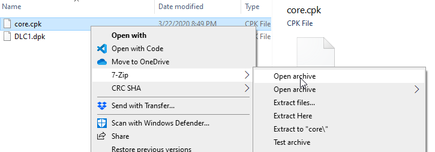
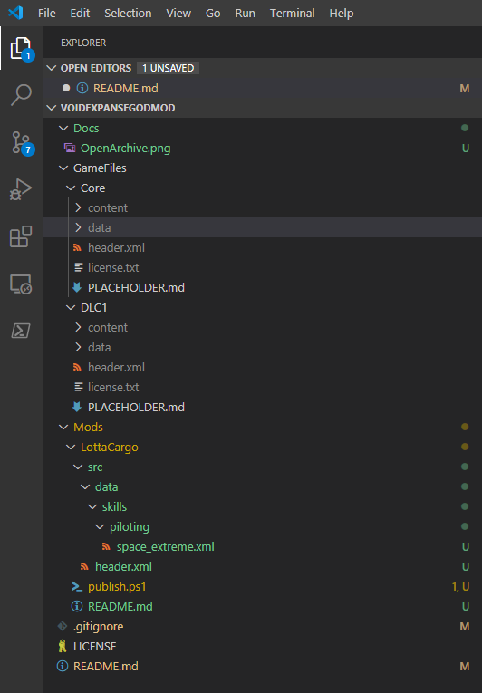

# VoidExpanse Mods

This is a repository to explain and help with modding VoidExpanse.

## Mod Basics

A mod is basically a ZIP file with the extension 'MPK'.  It should contain a
`header.xml` file with details and ids for your mod, and files that can override
or complement the files in the game.  Here's an example `header.xml` file
for the LottaCargo mod:

```xml
<?xml version="1.0" encoding="utf-8" standalone="yes"?>
<root>
  <game>VoidExpanse</game>
  <id>lottacargo</id>
  <title>Lotta Cargo</title>
  <author>me</author>
  <description>Tired of running out of space?  No fear!</description>
  <version>1.0.0</version>
  <min_game_version>0.0.0</min_game_version>
  <required_for_loading_savegame>0</required_for_loading_savegame>
  <updated>28-03-2020</updated>
  <modtype>2</modtype>
  <tags>Skills</tags>
</root>
```

You can copy this, all you really need to change is the 'id' which needs to be unique for
each mod you use, but you should probably change the title and description at least.

## Getting Started

I recommend installing the following tools:

* [7-Zip File Manager](https://www.7-zip.org/)
    * When integrated with explorer, you can right-click on an MPK (Mod PacK), CPK (Core PacK), or DPK (Dlc PacK) to open it and extract the files
* [Visual Studio Code](https://code.visualstudio.com/)
    * Great editor, but you can use whatever text editor you want
* [Powershell](https://docs.microsoft.com/en-us/powershell/scripting/install/installing-powershell?view=powershell-7)
    * Used to run the `publish.ps1` script to automatically bundle changes and install the mod so you don't have to manually do it

The core game files and DLC are in the game folders.  A good place to start is to see what the game files contain themselves.

1. Go to steam and right-click on Void Expanse and select 'Properties'
2. Click on the 'LOCAL FILES' tab at the top
3. Click on 'BROWSE LOCAL FILES...'

This should open the "...\steamapps\common\VoidExpanse" folder in your steam library.  Open the 'Core' directory and you can see
the `core.cpk` file which has the resources for the standard game.  If you have the DLC installed you'll also see `DLC1.dpk`.
These are just ZIP files with a different extension.

So right-click on `core.cpk` and select '7-Zip -> Open archive`.  This will open 7-Zip File Manager and you should see directories
'content' and 'data' and files 'header.xml' and 'license.txt'.  Select all 4 and drag them to the 'GameFiles/Core' folder
in this repository.  Don't worry, all files in the GameFiles directory are ignored except for the placeholder files.  Do the same
for `DLC1.dpk` into the `DLC1` directory in this repository.



Now open Visual Studio Code and open the directory where you cloned this repository.  Now you can see your mod files
and the game content files in the same editor:



## LottaCargo - basic mod design

For my mods I created the `Mods` directory.  Each mod has it's own subdirectory, so I created `Mods/LottaCargo'.
In this directory I added a script `publish.ps1`.  This script will bundle and compress the contents of the `src` folder
which contains the actual mod files and copy them to the mods folder.  After this you can access the mod in game.
If you copy this file, make sure to change the name of your mod in the second line:

```powershell
# $name is used for the zip (MPK) file
$name = "LottaCargo"
```

I added `src/header.xml`:

```xml
<?xml version="1.0" encoding="utf-8" standalone="yes"?>
<root>
  <game>VoidExpanse</game>
  <id>lottacargo</id>
  <title>Lotta Cargo</title>
  <author>me</author>
  <description>Tired of running out of space?  No fear!</description>
  <version>1.0.0</version>
  <min_game_version>0.0.0</min_game_version>
  <required_for_loading_savegame>0</required_for_loading_savegame>
  <updated>28-03-2020</updated>
  <modtype>2</modtype>
  <tags>Skills</tags>
</root>
```

To create a new skill, I created the same directory structure as in `Core`, `data/skills/piloting`.  I copied
the `space_optimization.xml` file from the same core folder and renamed it to `space_extreme.xml`.  I then
edited it to change the id.  If you kept the same file name and id you would be editing the existing skill.

## Installing your mod

The `publish.ps1` script will compress the contents of the `src` folder and create the `mpk` file in your mods directory.
To do this you should first exit the game if you have it open.  Otherwise the file will be locked, and you
need to restart the game to reload mod contents anyway.

To run the script you can run it from powershell or from within VSCode.  You may need to have the
powershell extension installed.  I like opening a terminal from within VSCode by right-clicking on the
`publish.ps1` and selecting 'Open in Terminal' to open a terminal already in the correct path.  Then
I can run `./publish.ps1`.

While running the script, the game should be closed or the file will appear to be in use and the copy will fail.
You need to restart the game to see changes anyway.
